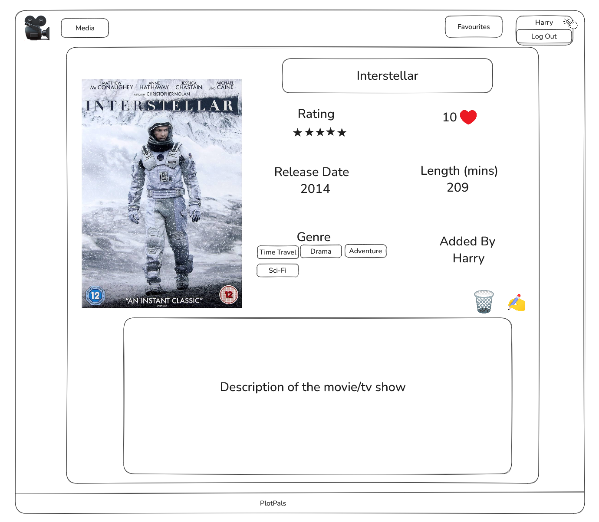
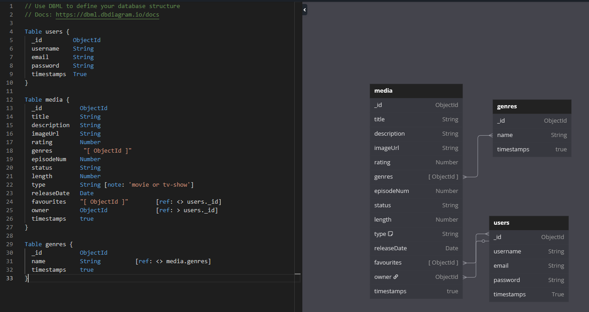

    Description

This is the penultimate project of the bootcamp where we have to build a full stack project. We will build a API using Express and Node and secured with JWT and interact with that API using MongoDB to be able to have full CRUD on the app

    Deployment link

myplotpals.netlify.app

    Getting Started/Code Installation

1. Download PlotPals-Frontend-Harry from Github
2. In the terminal Run NPM I to install all the dependencies
3. Create a .env file and inside add VITE_API_BASE_URL=https://myplotpalsapi.netlify.app/api
4. In the terminal Run npm run dev
5. Follow the link to the Page

    Timeframe & Working Team (Solo/Pair/Group)

Callum and I worked on this project in a pair, we got put into our team on Tuesday 13th May and the deadline for the project is Thursday 22nd May. Callums GitHub repo is https://github.com/Ryziou

    Technologies Used

Back End:
    JavaScript
    Netlify
    Bcryptjs
    Cors
    Dotenv
    Express
    JsonWebToken
    Mongoose
    Morgan
    Multer
    Multer-storage-cloudinary
    Serverless-http

Front End:
    React
    React-Dom
    React-Router
    Reach-Select
    Axios

Development Tools:
    Visual Studios
    Zoom
    Postman
    Slack
    Termial
    Cloudinary
    MongoDB
    Trello

Brief

- The back-end application is built with Express and Node.
- The front-end application is built with React.
- MongoDB is used as the database management system.
- The back-end and front-end applications implement JWT token-based authentication to sign up, sign in, and sign out users.
- Authorization is implemented across the front-end and back-end. Guest users (those not signed in) should not be able to create, update, or delete data in the application or access functionality allowing those actions.
- The project has at least two data entities in addition to the User model. At least one entity must have a relationship with the User model.
- The project has full CRUD functionality on both the back-end and front-end.
- The front-end application does not hold any secret keys. Public APIs that require secret keys must be accessed from the back-end application.
- The project is deployed online so that the rest of the world can use it.

Planning

This is our initial wireframe of how we wanted the site to look. The top row is what you can see and access if you have signed in and the bottom is if you havnt registered or signed in yet. We were thinking we could create a card for the media which will allow use to keep the theme throughout and display the media neatly. Our aim was to make the website neat and clean and easy to navigate which I believe we achived.

We also created a version of how we wanted to have the show page to look which keeps the theme of the media card but also added all of the details from the individual media.

He is our entity relationship diagram which allowed us to understand how each of the components of the app would work together and where each of the individual files would be placed.

In Trello we set out what need to be done for this project, we then assigned them so we knew what we needed to do. From there we move and Item which we were working on into our tab so we knew which part the other was working on. Once completed and checked they were moved to the completed tab.

    Backend

Callum:

Created backend and frontend GitHub repositories.
Set up the initial Express server structure and added all required dependencies.
Connected the application to MongoDB Atlas.
Defined the Media model and created the seed database.
Created authentication middleware to protect routes.
Defined the Genre model with virtual fields.
Created both Media and Genre controllers.
Applied and tested authentication middleware on appropriate routes.
Updated the Media model with validation rules.
Extended login functionality to accept either username or email.

Harry:

Defined the User model.
Created User controller with login/register functionality.
Implemented the global errorHandler middleware and error.js utilities.
Created the Favourites controller to manage user favourite media.
    
    Frontend

Callum:

Set up base file structure for the initial commit to ensure project consistency.
Created and configured Axios services for Media, Favourites, and Genres.
Built full CRUD components for Media (Index, Show, Create, Delete, Update).
Developed the reusable MediaCard component used across multiple pages (Home, Index, Genre).
Styled Media components such as (Home, Index, Create, Update, MediaCard)and the User Favourites component using CSS.
Created footer to display credentials

Harry:

Created and implemented Login/Register forms and authentication services.
Developed and styled the Navigation Bar.
Set up JWT token handling with localStorage for authentication.
Created the reusable useFetch custom hook for data fetching.
Built Favourite components for the home page and the user's favourites section.
Built Genre components (Index and Show) to display media by genre.
Created the reusable ErrorMessage component for form and API error handling.
Implemented functionality to favourite/unfavourite a media item.
Styled the MediaShow component.

Build/Code Process

Instructions

The Build/Code Process will be the longest section of your ReadMe and will be most insightful to the engineers that review them. This is where you will discuss the steps you took to code the project.

You want to see your ReadMes as a way to walk the engineers through your approach and problem solving from the start of the project through to the end.

You'll need to include a minimum of 3-4 code snippets, highlighting code you're particularly proud of and these code snippets will have descriptions on what you did, how and why to set the context of the snippet you include. These explanations are important for the engineers, as they will want to understand what you did and the reasoning behind the steps you took.

You don't need to document every single thing you coded, but walk them through the key sections of the project build.

For any group project, you will just focus on your contributions. 

Some people will document the build/code process by discussing the key stages they worked on. Others will do a day by day guide. It’s entirely up to you how you structure this, as long as you discuss all the key things above.

Insert your Build/Code Process here:

Challenges

Instructions

Challenges are great for showing your learning journey and problem solving, and this is a section that many engineers will check out. Every day of your engineering career you’ll encounter challenges, this is part of your growth and development. It’s the challenges you encounter that helps you become a stronger and more competent engineer. 

Here you will detail any particular challenges you encountered as you were coding the project. 

Questions to answer here:

What technical challenges did you come across? 
Why were these challenges? 
What problem solving did you do to rectify them?
Team dynamics/ Project management
Tools/Tech you used

Insert your Challenges here:

Wins

Instructions

The Wins section is your opportunity to highlight the aspects of your project you are most proud of. See this as your chance to showcase these parts of your projects to the engineers reading your ReadMes.

Things you could discuss here:

Interesting problem solving you did
Strong sections of code
Collaboration with other team members
Visual design of the project

Insert your Wins here:

Key Learnings/Takeaways

Instructions

This section is one of the other most important parts of your ReadMe from an engineers’ perspective and helps to differentiate each of you from your classmates and team members. 

Engineers love to understand what you learn from each project and how it has shaped you as an engineer. 

See this as your opportunity to show the engineers how your skills grew during each project sprint. 

Things you could discuss here:

What Technologies/Tools do you now feel more confident with? Tell them specifically what you learnt about these. 
What engineering processes did you become more comfortable with? Standups? Pair programming? Project management? Tell them what you learnt from these processes?

Insert your Key Learnings/Takeaways here:

Bugs

Instructions

If you have any bugs in your project, it’s important that you flag them in your ReadMe. This helps the engineers reviewing your projects to understand that you are aware that there are issues - if you don’t flag these, then they won’t have that visibility that you know these problems are in your code and it can result in them not having a full understanding of your technical knowledge. 

In either sentences or bullets, explain what the bugs are.

If you have no bugs, you can leave this section blank.

Insert your Bugs here:

Future Improvements

Instructions

It’s common to get to the end of your project and have ideas on what you would do if you have more time, as well as how you might improve it. 

If you do, you should detail this here. It’s great to give that context on potential future improvements, to share your creative or technical ideas with the engineers reading your ReadMes.

In either sentences or bullets, explain what your future improvements would be.

Insert your Future Improvements here:
